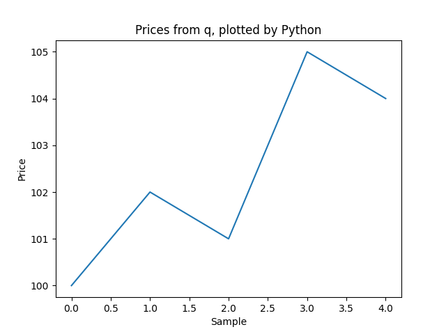

# Python from q with embedPy

Keep your data in q. Call NumPy for a statistic, pandas for an aggregation,
and matplotlib for a chart. You can also pass a q function to SciPy and let
Python call it while fitting a model.

Use [KX's embedPy](https://github.com/KxSystems/embedPy) to call Python from PeachQ.



*Generated by the recipe below from five example prices in a q vector.*

## Run it

Use Linux x86-64 with glibc, Bash, `curl`, `tar`, GNU `sed`, and Python 3 with
`venv` and `pip` available. This installs the Python packages in a local virtual
environment; it does not install Python itself. Start in a fresh directory.

Use PeachQ's **DuckDB/glibc download** here: the standard static Linux executable
cannot load embedPy's shared library. DuckDB itself is not used by this example.

```bash
set -euo pipefail
mkdir peachq-python-demo && cd peachq-python-demo
mkdir peachq
curl -fL https://peachq.org/download/peachq-linux-x64-duckdb.tar.gz | tar -xz -C peachq
curl -fL https://github.com/KxSystems/embedPy/releases/download/1.5.0/embedPy_linux-1.5.0.tgz | tar -xz
python3 -m venv .venv
. .venv/bin/activate
python -m pip install "numpy<2" pandas scipy matplotlib

# Adapt the loader's shell redirect and two K expressions for PeachQ.
sed -i.before-peachq \
  -e 's/\\"2>/\\" 2>/g' \
  -e "s|^k)c:.*|c:{{'[y;x]}/[reverse x]}|" \
  -e "s|^k)ce:.*|ce:{{'[y;x]}/[enlist,reverse x]}|" p.q

cat > chart.q <<'Q'
\l p.q
np:.p.import`numpy
prices:100 102 101 105 104f
show np[`:mean;<]prices
.p.import[`matplotlib;`:use;`Agg];
plt:.p.import`matplotlib.pyplot
plt[`:plot;til count prices;prices];
plt[`:title;"Prices from q, plotted by Python"];
plt[`:xlabel;"Sample"];
plt[`:ylabel;"Price"];
plt[`:savefig;"prices.png"];
plt[`:close][];
Q
QHOME="$PWD" ./peachq/q chart.q
```

The mean is **102.4**. Open `prices.png` to see the chart above.

## Open an interactive session

Keep the virtual environment active. From the same directory:

```bash
QHOME="$PWD" ./peachq/q
```

Load embedPy and import NumPy:

```q
\l p.q
np:.p.import`numpy
np[`:arange;<]5
p)print("hello from python")
```

```text
0 1 2 3 4
hello from python
```

`.p.import` imports a Python module. The attribute selector `` `:arange ``
gets its `arange` function; `<` requests the result as q data. Lines starting
with `p)` execute Python in the same process.

## Send q data to NumPy

Define a vector in q and pass it to Python functions:

```q
prices:100 102 101 105 104f
np[`:mean;<]prices
np[`:std;<]prices
```

Output:

```text
102.4
1.854724
```

The vector crosses into Python as an argument, and both results return as q
values. No CSV file or separate Python process is needed for these calls.

## Group a q table with pandas

Create four example trades and build a pandas DataFrame from the table's column
dictionary:

```q
pd:.p.import`pandas
trades:([]sym:`AAPL`MSFT`AAPL`MSFT;size:10 20 30 40;price:100 200 102 201f)
df:pd[`:DataFrame.from_dict;flip trades]
df[`:groupby;`sym][`:sum][`numeric_only pykw 1b][`:to_dict][]`
```

Output:

```text
size | `AAPL`MSFT!40 60
price| `AAPL`MSFT!202 401f
```

The size totals are 40 for AAPL and 60 for MSFT. This example sums both numeric
columns to demonstrate the round-trip; the price sums are not a market-data
statistic. `pykw` supplies a Python keyword argument. The final backtick converts
the Python dictionary into q data.

## Let SciPy call a q function

Fit the line `y = a*x + b` to five points. The model is a q function; SciPy calls
it during optimization:

```q
fit:.p.import[`scipy.optimize;`:curve_fit;<]
first fit[{[x;a;b](a*x)+b};0 1 2 3 4f;1 3 5 7 9f;1 0f]
```

Output:

```text
2 1f
```

The fitted slope is 2 and intercept is 1. Parentheses around `a*x` express the
intended formula under q's right-to-left evaluation.

The last argument, `1 0f`, supplies initial guesses for the two parameters.
Keep it: SciPy could not infer the signature of the embedded q callback in this
test. Supplying initial values avoids that introspection requirement, as described
in the [SciPy `curve_fit` reference](https://docs.scipy.org/doc/scipy-1.15.3/reference/generated/scipy.optimize.curve_fit.html).

## Make the chart

Pass the original q vector to matplotlib and save an image:

```q
.p.import[`matplotlib;`:use;`Agg];
plt:.p.import`matplotlib.pyplot
plt[`:plot;til count prices;prices];
plt[`:title;"Prices from q, plotted by Python"];
plt[`:xlabel;"Sample"];
plt[`:ylabel;"Price"];
plt[`:savefig;"prices.png"];
plt[`:close][];
```

Open `prices.png` in the current directory to see the chart at the top of this
article. The `Agg` backend saves the image without requiring a desktop window.

[Download the complete q script](examples/embedpy-demo.q). Save it in the demo
directory, then run:

```bash
QHOME="$PWD" ./peachq/q embedpy-demo.q
```

The script prints each result and saves `prices.png`.

For the native interface behind embedPy, see [C extensions with `2:`](../peachq/c-extensions.md),
including shared-library loading, object ownership and callbacks into q.

For more calling forms, see the [embedPy user guide](https://github.com/KxSystems/embedPy/blob/master/docs/README.md).

## What to keep in mind

You can now pass q data to Python, return results, fit a q callback with SciPy
and save a chart with matplotlib.

- **Shared libraries:** use the glibc PeachQ package and a matching 64-bit Python.
- **Loader adaptations:** keep the three `sed` replacements in the setup. The
  attached shell redirect loses probe output in PeachQ, and the loader's two
  K-mode composition expressions need their q equivalents.
- **NumPy:** use `numpy<2` with this embedPy release. NumPy 2 can return zero-filled
  arrays and incorrect statistics through this interface.
- **Python environment:** activate `.venv` before starting q. If you move the
  installation, update `QHOME` to the directory containing `p.q` and `l64/p.so`.
- **Callbacks:** give `curve_fit` initial parameter values for q functions;
  Python cannot infer their parameter names here.
- **Charts:** `Agg` writes an image without opening a window. This recipe does
  not set up an interactive GUI backend or threaded Python execution.
