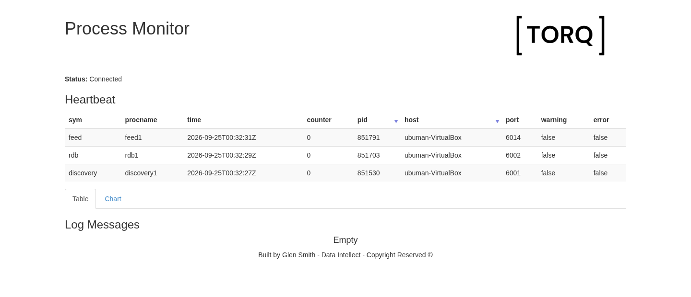

# Live market data with TorQ and PeachQ

Turn a fresh directory into a live market-data system: a generated feed sends
trades through a tickerplant into a real-time database. Query the stream from
another terminal and watch process heartbeats in your browser.



[Data Intellect's TorQ Finance Starter Pack](https://github.com/DataIntellectTech/TorQ-Finance-Starter-Pack)
provides the application and synthetic trade/quote feed. PeachQ runs its q processes.

## Run it

Use Linux x86-64 with Bash, `curl`, `tar`, GNU `sed` and `envsubst`
(`gettext-base` on Debian/Ubuntu). Ports 6000, 6001, 6002, 6009 and 6014 must be free.
Run this in a fresh directory. Keep the archive filenames as shown: TorQ's
installer uses them to construct its deployment paths.

```bash
set -euo pipefail
mkdir peachq-torq-demo && cd peachq-torq-demo
mkdir peachq
curl -fL https://peachq.org/download/peachq-linux-x64.tar.gz | tar -xz -C peachq
export PATH="$PWD/peachq:$PATH"
export SSL_CA_CERT_FILE=/etc/ssl/certs/ca-certificates.crt

TORQ_REV=7e77714a62fb49dc42b11500a96bcfa535ce9a19
FSP_REV=50fcd5ad6d8e50fcd71965010ce38a1fccdad87b
curl -fL "https://github.com/DataIntellectTech/TorQ/archive/$TORQ_REV.tar.gz" -o "TorQ-$TORQ_REV.tar.gz"
curl -fL "https://github.com/DataIntellectTech/TorQ-Finance-Starter-Pack/archive/$FSP_REV.tar.gz" -o "TorQ-Finance-Starter-Pack-$FSP_REV.tar.gz"
tar -xzf "TorQ-$TORQ_REV.tar.gz"
bash "TorQ-$TORQ_REV/installtorqapp.sh" \
  --torq "$PWD/TorQ-$TORQ_REV.tar.gz" \
  --installfile "$PWD/TorQ-Finance-Starter-Pack-$FSP_REV.tar.gz" \
  --releasedir "$PWD/deploy" --data "$PWD/data"

# Adapt the monitor's WebSocket subscription (explained below).
sed -i.before-peachq 's/wssub:{sub\[x;`\];}/wssub:{del[x;.z.w];w[x],:enlist(.z.w;`);}/' \
  deploy/TorQ/latest/code/common/html.q
bash deploy/bin/torq.sh start discovery1 stp1 rdb1 feed1 monitor1
sleep 10
q -conn localhost:6002:admin:admin -eval 'select trades:count i,volume:sum size,vwap:size wavg price by sym from trade'
```

Open [the process monitor](http://localhost:6009/.non?monitorui). Allow about a
minute for the first heartbeat cycle. Trade counts and prices vary with the feed.
If startup takes longer, wait for the RDB to initialize and repeat the query.

## What you started

The five processes form a small streaming system:

| Process | Role |
|---|---|
| `discovery1` | Helps processes find each other |
| `stp1` | Receives and logs the generated stream |
| `rdb1` | Holds current trades and quotes for queries |
| `feed1` | Generates example trades and quotes |
| `monitor1` | Serves the browser monitor |

TorQ's installer creates the application layout, data directories and environment
setup. Its launcher loads that environment automatically and finds `q` through
`PATH`. Keep these exports in the terminal where you start the application.

Check the processes and the RDB:

```bash
bash deploy/bin/torq.sh summary
q -conn localhost:6002:admin:admin -eval '.proc.initialised'
```

The RDB returns `1b` when initialized. The summary also lists other configured
processes; this recipe starts only the five above.

## Query the incoming trades

From another terminal, enter the demo directory and set the executable path:

```bash
cd peachq-torq-demo
export PATH="$PWD/peachq:$PATH"
q -conn localhost:6002:admin:admin -eval 'count trade'
```

Run the count again after a few seconds. It increases as the feed sends new
trades. `-conn` sends the expression to the running RDB, so you are querying its
live table.

Group by symbol to calculate trade count, total volume and volume-weighted price:

```bash
q -conn localhost:6002:admin:admin -eval 'select trades:count i,volume:sum size,vwap:size wavg price by sym from trade'
```

`count i` counts rows, `sum size` totals the quantity, and `size wavg price`
weights each price by its trade size. The query returns one row per symbol.

## Watch the monitor

The heartbeat view reports discovery, feed and RDB activity. This configuration
does not publish a tickerplant heartbeat. Counters and timestamps update over
WebSockets; an empty view immediately after startup can mean the first heartbeat
has not arrived yet.

The setup changes one subscription function in TorQ's `html.q`. Its original
subscription path asks for a table schema for a function-valued entry. The
replacement registers the WebSocket directly, allowing the initial data and
subsequent heartbeat updates to arrive. The original file remains alongside it
with a `.before-peachq` suffix.

## Stop the demo

```bash
bash deploy/bin/torq.sh stop monitor1 feed1 rdb1 stp1 discovery1
```

This stops the five processes. Downloaded files and generated data remain in the
demo directory.

## What to keep in mind

You now have a generated feed, tickerplant, live query database and browser monitor.

- **Local demo credentials:** the Starter Pack uses `admin:admin`. Run this on a
  development machine; configure authentication and network access before exposing it.
- **Monitor adaptation:** retain the subscription change above. It applies to this
  pinned TorQ monitor; the trade pipeline needs no corresponding source edit.
- **Remote browser access:** use the server hostname instead of `localhost`, and
  ensure the hostname embedded by the monitor resolves from your browser.
- **Scope:** this recipe runs the live-data path. It does not configure a gateway,
  HDB/WDB, recovery, end-of-day processing or email. Those need their own setup.
