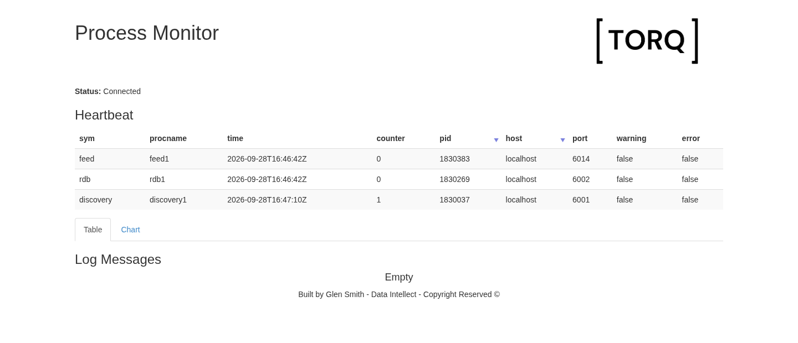

<!-- peachq: audience="You use TorQ, or run your own kdb+ framework, and doubt that a new q implementation can run a real framework." goal="Run TorQ's live path on PeachQ with TorQ's own installer and launcher, see which q features it relied on, and know the current limitations." -->

# TorQ on PeachQ

<video class="peachq-video" controls preload="none" playsinline src="/video/torq-FHD.mp4" poster="/recordings/torq/intro-frame.png"></video>

Run TorQ's Finance Starter Pack on PeachQ: a discovery service, a tickerplant, a
real-time database (RDB), a generated trade feed and the browser process monitor.
TorQ is installed with its own `installtorqapp.sh` and started with its own
`torq.sh`. One line of TorQ's monitor code is changed, and this page explains why.



*TorQ's process monitor, served by `monitor1` on PeachQ, receiving heartbeats over a WebSocket.*

A query sent from another process to the running RDB returns live trades,
aggregated by symbol:

```text
| sym    | trades | volume | vwap     |
| symbol | long   | int    | float    |
|========|--------|--------|----------|
| AAPL   | 14     | 771    | 83.80952 |
| AIG    | 11     | 900    | 26.92084 |
| AMD    | 4      | 52     | 32.96019 |
| DELL   | 7      | 64     | 12.02    |
| DOW    | 3      | 353    | 19.95748 |
| GOOG   | 20     | 580    | 71.65279 |
| HPQ    | 19     | 612    | 35.94    |
| IBM    | 7      | 427    | 42.31597 |
| INTC   | 8      | 393    | 50.85028 |
| MSFT   | 21     | 1543   | 29.07424 |
```

## What TorQ is

[TorQ](https://github.com/DataIntellectTech/TorQ) is Data Intellect's open-source
framework for building kdb+ applications. It supplies standard processes, such as
discovery, tickerplants, RDBs, HDBs, gateways and a monitor, together with shared
code for process startup, logging, connection management, timers, heartbeats and
access control. The
[Finance Starter Pack](https://github.com/DataIntellectTech/TorQ-Finance-Starter-Pack)
is an example application built on TorQ, with a feed that generates trades and
quotes. Both are MIT-licensed.

## What had to work

TorQ is a demanding test because it uses much of q at once. The table lists what
the five processes relied on. Each row was observed on the running stack with
PeachQ v0.85, mostly by sending queries with `q -conn` to each process. Counts
vary slightly between runs.

| q feature | What TorQ does with it | Observed on PeachQ |
|---|---|---|
| Loading a code tree | `torq.q` loads TorQ's common code, the process-type code and the application's code | Each process loaded 26 to 55 files (`count .proc.loadedf`). TorQ's `code` directory has 123 `.q` files and 11,105 lines. |
| Command-line options and environment variables | `torq.sh` passes `-stackid`, `-proctype`, `-procname`, `-load` and `-procfile`; `setenv.sh` exports `KDBCONFIG`, `KDBCODE` and more | `.z.x` holds 12 arguments (16 for `stp1`), and `getenv` returns the exported paths. |
| `.z` handlers | TorQ wraps the message, connection, HTTP, WebSocket, timer and exit handlers for logging and access control | Every process defines `.z.pg` `.z.ps` `.z.po` `.z.pc` `.z.pw` `.z.pi` `.z.ph` `.z.pp` `.z.ts` `.z.ws` `.z.wo` `.z.wc` and `.z.exit` (`stp1`: all except `.z.pp`). A bare PeachQ process defines only `.z.ph`. |
| Authentication with `.z.pw` | The processes accept the configured `admin:admin` user | `admin:admin` connects; a wrong password or no credentials are refused with `access`. |
| IPC and connection tracking | Discovery registers processes; each process records who connects and when they disconnect | `stp1`'s `.clients.clients` lists the RDB and feed connections and the close times of short query connections (`.z.po` and `.z.pc`). |
| Timers | `\t` drives TorQ's timer table (`.timer.timer`) | `\t` is 200 ms (`stp1`: 1000 ms). Each process except `stp1` has 6 to 11 timer jobs; the feed publishes every 200 ms and heartbeats go out every 30 seconds. |
| Tickerplant publish and subscribe | The feed calls `.u.upd` on the segmented tickerplant, which publishes to subscribers | `rdb1` subscribes to `trade`, `quote` and `packets`; its trade count rose from 673 to 700 in 3 seconds. |
| Tickerplant logging | `stp1` writes one log file per table under `data/tplogs` | The trade log grows while the feed runs, and `-11!(-2;file)` reads its messages back. |
| HTTP and WebSockets | `monitor1` serves the monitor page and pushes heartbeats to the browser | The page returns HTTP 200. A headless Chromium received the initial `start` message and heartbeat updates (with the change described below). |

Some of this needed exact q behaviour. TorQ's loader records each file in
`.proc.loadedf` and checks `x in loadedf` before loading it. The list starts as
`enlist enlist""`, so the check relies on `in` being string-atomic:
`"apple" in enlist each ("qwe";"apple";"jhjg")` must return `1b`.
In [TorQ issue #765](https://github.com/DataIntellectTech/TorQ/issues/765), a TorQ
contributor pointed to q's documented
[string-atomic](../basics/atomic.md#string-atomic) behaviour of `in`, and PeachQ
implemented it.

If you run your own kdb+ framework, use the table as a checklist: the more of
these features your framework shares with TorQ, the more of this run applies to
it. This recipe tests TorQ only.

## Run it

Use Linux x86-64 with Bash, `curl`, `tar` and GNU `sed`. Ports 6000, 6001, 6002,
6009 and 6014 must be free. Run this in a fresh directory. Keep the archive
filenames as shown: TorQ's installer derives its version directory names from them.

```bash
mkdir peachq-torq && cd peachq-torq
mkdir peachq
curl -fL https://peachq.org/download/peachq-linux-x64.tar.gz | tar -xz -C peachq
export PATH="$PWD/peachq:$PATH"

TORQ_REV=7e77714a62fb49dc42b11500a96bcfa535ce9a19
FSP_REV=50fcd5ad6d8e50fcd71965010ce38a1fccdad87b
curl -fL "https://github.com/DataIntellectTech/TorQ/archive/$TORQ_REV.tar.gz" -o "TorQ-$TORQ_REV.tar.gz"
curl -fL "https://github.com/DataIntellectTech/TorQ-Finance-Starter-Pack/archive/$FSP_REV.tar.gz" -o "TorQ-Finance-Starter-Pack-$FSP_REV.tar.gz"
tar -xzf "TorQ-$TORQ_REV.tar.gz"
bash "TorQ-$TORQ_REV/installtorqapp.sh" \
  --torq "$PWD/TorQ-$TORQ_REV.tar.gz" \
  --installfile "$PWD/TorQ-Finance-Starter-Pack-$FSP_REV.tar.gz" \
  --releasedir "$PWD/deploy" --data "$PWD/data"

# The one change: register monitor WebSockets directly (see below).
sed -i.before-peachq 's/wssub:{sub\[x;`\];}/wssub:{del[x;.z.w];w[x],:enlist(.z.w;`);}/' \
  deploy/TorQ/latest/code/common/html.q

bash deploy/bin/torq.sh start discovery1 stp1 rdb1 feed1 monitor1
sleep 10
q -conn localhost:6002:admin:admin -eval 'select trades:count i,volume:sum size,vwap:size wavg price by sym from trade'
```

The last command prints one row per symbol, like the table at the top of this
page. Trade counts and prices vary with the generated feed. If the table is
empty, the RDB is still starting: wait a few seconds and repeat the query.

Open <http://localhost:6009/.non?monitorui> in a browser. The first heartbeats
appear within 30 seconds.

## Walkthrough

### The five processes

The installer unpacks TorQ and the Starter Pack under `deploy/`, writes
`deploy/bin/setenv.sh` with this directory's paths and creates the data
directories. `torq.sh` loads that environment and finds `q` on `PATH`, so the
PeachQ `q` runs every process.

| Process | Port | Role |
|---|---|---|
| `stp1` | 6000 | Segmented tickerplant: receives, logs and publishes the feed |
| `discovery1` | 6001 | Lets processes find each other by type |
| `rdb1` | 6002 | Holds today's trades and quotes for queries |
| `monitor1` | 6009 | Collects heartbeats and serves the browser monitor |
| `feed1` | 6014 | Generates trades and quotes every 200 ms |

Check them with TorQ's own summary:

```bash
bash deploy/bin/torq.sh summary
```

```text
TIME      |  PROCESS        |  STATUS  |  PID      |  PORT
16:48:03  |  discovery1     |  up      |  1830037  |  
16:48:04  |  stp1           |  up      |  1830157  |  
16:48:04  |  rdb1           |  up      |  1830269  |  
16:48:04  |  hdb1           |  down    |              
...
16:48:05  |  monitor1       |  up      |  1830501  |  
...
16:48:06  |  feed1          |  up      |  1830383  |  
...
```

The summary lists all 23 processes in the Starter Pack's `process.csv`; this
recipe starts five of them. The `PORT` column is filled only when `netstat` is
installed.

### Query the live RDB

`q -conn` sends an expression to a running q process and prints the result, much
like running it over a handle from `hopen`. The target takes the same form as
`hopen`, here with TorQ's `admin:admin` user. In a new terminal, first run
`cd peachq-torq` and `export PATH="$PWD/peachq:$PATH"`.

```bash
q -conn localhost:6002:admin:admin -eval 'count trade'
```

```text
1158
```

Five seconds later:

```text
1229
```

The count keeps rising as `stp1` publishes new trades. The aggregate query from
the setup groups them by symbol: `count i` counts rows, `sum size` totals volume
and `size wavg price` is the volume-weighted average price.

The RDB also holds `quote`, `packets`, `heartbeat` and `logmsg`, and any q
expression works:

```bash
q -conn localhost:6002:admin:admin -eval '5#select from trade where sym=`AAPL'
```

```text
| time                          | sym    | price | size | stop    | cond | ex   | side   |
| timestamp                     | symbol | float | int  | boolean | char | char | symbol |
|-------------------------------|--------|-------|------|---------|------|------|--------|
| 2026.09.28D15:46:14.604203876 | AAPL   | 83.61 | 31   | 0       | R    | N    | sell   |
| 2026.09.28D15:46:15.812567832 | AAPL   | 83.82 | 19   | 0       | L    | N    | sell   |
| 2026.09.28D15:46:15.812567832 | AAPL   | 83.81 | 51   | 1       | B    | N    | sell   |
| 2026.09.28D15:46:15.812567832 | AAPL   | 83.75 | 46   | 0       | K    | N    | sell   |
| 2026.09.28D15:46:16.219041415 | AAPL   | 83.79 | 91   | 0       |      | N    | buy    |
```

### Heartbeats and the monitor

Each process publishes a heartbeat every 30 seconds. `monitor1` keeps the latest
one per process:

```bash
q -conn localhost:6009:admin:admin -eval 'select sym,procname,time,counter from .hb.hb'
```

```text
| sym       | procname   | time                          | counter |
| symbol    | symbol     | timestamp                     | long    |
|-----------|------------|-------------------------------|---------|
| discovery | discovery1 | 2026.09.28D16:48:11.168426700 | 3       |
| rdb       | rdb1       | 2026.09.28D16:48:12.527935936 | 3       |
| feed      | feed1      | 2026.09.28D16:48:13.202565153 | 3       |
```

The browser monitor shows the same table and updates it over a WebSocket. This
configuration does not publish a heartbeat from `stp1`.

### Stop the processes

```bash
bash deploy/bin/torq.sh stop monitor1 feed1 rdb1 stp1 discovery1
```

Downloaded files, tickerplant logs and process logs remain under the directory.

## The one change

The setup replaces one line in TorQ's `code/common/html.q`. The original file is
kept alongside it as `html.q.before-peachq`.

```text
/ original
wssub:{sub[x;`];}
/ replacement
wssub:{del[x;.z.w];w[x],:enlist(.z.w;`);}
```

When a browser connects, the monitor's `start` function subscribes it to
`heartbeat`, `logmsg` and `lmchart` through `.html.wssub`. That calls
`.html.sub`, then `.html.add`, which registers the WebSocket handle and then
builds an empty schema that `wssub` discards. `lmchart` is a function, not a
table, so the schema step evaluates `@[0#v;`sym;`g#]` with a function `v`. On
PeachQ, `0#` of a function returns `()`, and applying `` `g# `` to `sym` of that
empty list signals `'type`. The error stops `start`, so the browser never
receives its initial data.

The replacement performs only the registration step. Without it, heartbeat
updates still arrive, but the initial `start` message does not.

## What you have running

You installed an unmodified TorQ release and application with TorQ's own scripts,
started five communicating processes on PeachQ, queried a live RDB from another
process and watched heartbeats in TorQ's browser monitor.

Current limitations:

- **Monitor subscription:** PeachQ v0.85 needs the one-line `html.q` change above.
  It can be dropped once the unmodified `.html.add` path runs on PeachQ.
- **Live path only:** HDB, WDB and end-of-day processing are not yet implemented
  in PeachQ, so this recipe does not start those processes. The gateway,
  recovery and email features have not been tested.
- **Local credentials:** the Starter Pack's `admin:admin` user is for local use.
  Configure authentication and network access before exposing the ports.

Found a problem running TorQ or your own framework on PeachQ? Please
[report it on the PeachQ issue tracker](https://github.com/peachq-org/peachq/issues).
