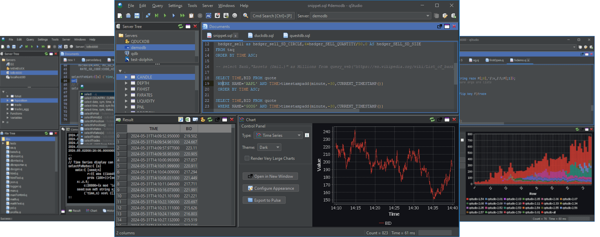
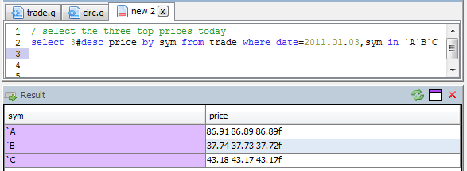

<!-- peachq: audience="You have PeachQ running and want a desktop editor that sends queries to it and shows results as tables and charts. You know enough q to write a select." goal="Connect qStudio to a PeachQ process, run a query with a keyboard shortcut, browse the table in the server tree and chart a time series." -->

# qStudio on PeachQ

<video class="peachq-video" controls preload="none" playsinline src="/video/qstudio-FHD.mp4" poster="/recordings/qstudio/intro-frame.png"></video>

[qStudio](https://github.com/timestored/qstudio) is a free, Apache-licensed SQL
and q editor for Windows, macOS and Linux. It connects to a q process over IPC,
highlights q, completes names from the server, shows results as tables and
charts them with one click.



## Setup

qStudio needs Java 8 or later. Check with `java -version`.

Start PeachQ listening on a port. On Linux x64 with glibc:

```bash
curl -fL https://peachq.org/download/peachq-linux-x64-duckdb.tar.gz -o peachq.tar.gz
tar -xzf peachq.tar.gz
./q -p 5000
```

Create a small table to query:

<!-- peachq: title="Create a trade table" -->
```q
trade:([]time:.z.p+0D00:00:01*til 100;sym:100?`AAPL`MSFT`GOOG;price:100+100?10f;size:100?1000)
```

Leave that process running. Install qStudio from the
[qStudio download page](https://www.timestored.com/qstudio/download), which has
a Windows installer, a macOS app and a jar for Linux, and start it.

## Connect to PeachQ

1. Open **Server** and choose **Add Server**.
2. Set the type to **kdb**, the host to `localhost` and the port to `5000`.
   Leave the username and password empty; PeachQ does not check them by default.
3. Click **Add**. The server tree on the left lists `trade` under Tables.

## Run a query

Type a query in the editor and press **Ctrl+Q** to run the statement under the
cursor, or select text and press **Ctrl+E**. On macOS use Cmd in place of Ctrl.

```q
select avg price,sum size by sym from trade
```

The result panel shows the keyed table. Grouping without aggregating returns
nested columns, which the result viewer shows in full:

```q
select price by sym from trade
```



## Chart a time series

Run a query that returns a time column first and numeric columns after it:

```q
select time,price from trade where sym=`AAPL
```

Open the **Chart** panel and choose **Time Series**. qStudio plots `price`
against `time`. The chart panel redraws for each new result, so edit the query
and run it again to compare symbols.

## Browse the server

The **Server Tree** lists tables, functions and variables defined in the
process. Expanding `trade` shows its columns and types, and double-clicking a
table runs a query that previews it.
