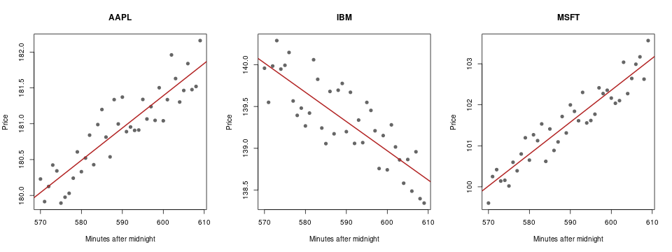

<!-- peachq: audience="You are a q developer or PeachQ user who knows basic q and enough R to want its statistics and plotting inside a q session, with R installed on Linux x86-64." goal="Load embedR into PeachQ, move data both ways with the type mappings, run R statistics on a q table, call R functions with q arguments and produce a chart, having seen each step work." -->

# R from q with embedR

<video class="peachq-video" controls preload="none" playsinline src="/video/embedr-HD.mp4" poster="/recordings/embedr/intro-frame.png"></video>

[embedR](https://github.com/KxSystems/embedr) loads R into the PeachQ process, so
a q table becomes an R data frame without a file or a socket in between. You'll
build embedR, summarise and model a q table in R, call R functions with q
arguments, and save this chart from the same session:



*Generated by the recipe below: 120 example trades built in q, fitted with R's
`lm` and drawn with R base graphics.*

## Run it

Use Linux x86-64 with glibc, Bash, `curl`, `tar`, GCC and `make`, and R built
as a shared library with its development headers. On Debian and Ubuntu the
`r-base` and `r-base-dev` packages provide both. This recipe does not install R
itself or any R packages. Start in a fresh directory.

--8<-- "includes/linux-glibc.md"

embedR has no prebuilt Linux archive for its current release, so the second
`curl` fetches the v1.5.1 source and `make` builds it against your R. No changes
to embedR's source or its `rinit.q` loader are needed.

```bash
set -euo pipefail
mkdir peachq-r-demo && cd peachq-r-demo
mkdir peachq
curl -fL https://peachq.org/download/peachq-linux-x64-duckdb.tar.gz | tar -xz -C peachq
curl -fL https://github.com/KxSystems/embedr/archive/refs/tags/v1.5.1.tar.gz | tar -xz
(cd embedR-1.5.1 && make)
mkdir -p l64
cp embedR-1.5.1/l64/embedr.so l64/
cp embedR-1.5.1/rinit.q .
export QHOME="$PWD" R_HOME="$(R RHOME)"
curl -fLO https://peachq.org/docs/interfaces/examples/embedr-demo.q
./peachq/q embedr-demo.q
```

`make` compiles `embedr.c` into `embedR-1.5.1/l64/embedr.so`, linked against
`libR.so`. The copy into `l64` under `QHOME` is where `rinit.q` finds the library
when it loads it with `` `embedr 2: ``. `R_HOME` tells the embedded R where its
own files are. The script prints each result below and saves `trades.png`.

If PeachQ reports that `libR.so` cannot be found, add R's library directory to
the search path with `export LD_LIBRARY_PATH="$(R RHOME)/lib"`.

## Open an R session

Keep the same shell, so `QHOME` and `R_HOME` stay set, and start PeachQ:

```bash
./peachq/q
```

Load the bridge, then start R:

```q
q)\l rinit.q
q)Ropen 0
0i
```

`rinit.q` defines `Ropen`, `Rset`, `Rget`, `Rcmd` and `Rfunc` from the shared
library. `Ropen` starts one embedded R interpreter in the q process; its
argument `1` would start R in verbose mode, and `0` starts it quietly. The other
functions call `Ropen` themselves if R is not yet running.

There is no function to close R. R stays loaded until the q process exits, and
embedded R cannot be started a second time in the same process. To start
again with an empty R workspace, run `` Rcmd"rm(list = ls())" ``.

## Send q data to R

Build 120 trades: three symbols, one trade per symbol per minute from 09:30, each
price a base level plus a steady drift and some noise. `\S 42` fixes the random
seed, so you get the same prices every run:

```q
q)\S 42
q)base:`AAPL`IBM`MSFT!180 140 100f
q)drift:`AAPL`IBM`MSFT!0.05 -0.03 0.08
q)trades:([]time:raze 3#'09:30+til 40;sym:120#key base)
q)trades:update price:base[sym]+(drift[sym]*`int$time-09:30)+-0.5+120?1f from trades
q)3#trades
| time   | sym    | price    |
| minute | symbol | float    |
|--------|--------|----------|
| 09:30  | AAPL   | 180.2291 |
| 09:30  | IBM    | 139.9579 |
| 09:30  | MSFT   | 99.60382 |
```

`Rset` copies a q value into an R variable. A table becomes a data frame, and
R's `print` writes to the q console:

```q
q)Rset["trades";trades]
q)Rget"class(trades)"
"data.frame"
q)Rcmd"print(head(trades, 3))"
  time  sym     price
1  570 AAPL 180.22909
2  570  IBM 139.95786
3  570 MSFT  99.60382
```

The `time` column arrived as 570: a q minute becomes an R integer counting
minutes after midnight. Symbols became R strings. Every q type has a fixed R
equivalent:

| q type | R class | Notes |
|---|---|---|
| boolean | `logical` | |
| byte | `raw` | |
| short, int | `integer` | Nulls become `NA` |
| long | `integer64` | Load the R package `bit64` to compute with it |
| real, float | `numeric` | Nulls become `NaN` |
| char vector | `character` of length 1 | One string; a char column of a table gives one string per row |
| symbol, enumeration | `character` | |
| guid | `character` | An atom gives one 36-character string; a vector gives a `list` of them |
| timestamp | `nanotime` | Load the R package `nanotime` to compute with it |
| month | `integer` | Months since 2000.01 |
| date | `Date` | |
| datetime | `POSIXct` | |
| timespan | `numeric` | Seconds |
| minute, second, time | `integer` | Minutes, seconds or milliseconds after midnight |
| table, keyed table | `data.frame` | Key columns become ordinary columns |
| dictionary | named vector or list | |
| general list | `list` | |

Use int or float columns for values you want to compute with in base R. A q
long such as `til 5` arrives as `integer64`, which base R functions do not
treat as numbers without `bit64`.

## Run R on it

`Rcmd` runs R code and returns nothing; `Rget` runs R code and returns the
result to q. Average the price for each symbol with R's `aggregate`, then ask
q the same question:

```q
q)Rcmd"stats <- aggregate(price ~ sym, trades, mean)"
q)Rget"stats"
| sym    | price    |
|        | float    |
|--------|----------|
| "AAPL" | 180.9181 |
| "IBM"  | 139.3373 |
| "MSFT" | 101.5387 |
q)select avg price by sym from trades
| sym    | price    |
| symbol | float    |
|========|----------|
| AAPL   | 180.9181 |
| IBM    | 139.3373 |
| MSFT   | 101.5387 |
```

The averages agree. The R data frame came back as a q table, but its `sym`
column is a list of strings, because R character vectors return as strings. An
R factor returns as a q symbol vector, so wrap a text column in `factor()` when
you want symbols back.

Now fit a straight line of price against time for each symbol, and collect the
slope and R² of each fit in a data frame:

```q
q)Rcmd"fits <- lapply(split(trades, trades$sym), function(d) lm(price ~ time, d))"
q)Rcmd"coefs <- data.frame(sym = factor(names(fits)), slope = sapply(fits, function(f) coef(f)[[2]]), r2 = sapply(fits, function(f) summary(f)$r.squared))"
q)Rget"coefs"
| sym    | slope       | r2        |
| symbol | float       | float     |
|--------|-------------|-----------|
| AAPL   | 0.04503951  | 0.8129359 |
| IBM    | -0.03497329 | 0.6836398 |
| MSFT   | 0.077853    | 0.892347  |
```

The fitted slopes, in price per minute, recover the drifts of 0.05, -0.03 and
0.08 used to build the data, and R² shows how much of each price series the line
explains. `fits` stays in the R session, so later R code can use the models.

Each `Rcmd` or `Rget` string is parsed as a single R expression. In
`` Rcmd"a <- 1; b <- 2" `` only `a` is assigned, so send one expression per call,
or wrap several in braces.

## Call R functions from q

`Rfunc` calls an R function by name with q values as its arguments. A general
list supplies one argument per item. Correlate the AAPL and MSFT price series:

```q
q)Rfunc["cor";(exec price from trades where sym=`AAPL;exec price from trades where sym=`MSFT)]
0.8783848
```

Functions you define in R work the same way:

```q
q)Rcmd"zscore <- function(x) (x - mean(x)) / sd(x)"
q)Rfunc["zscore";enlist 100 101 102 103f]
-1.161895 -0.3872983 0.3872983 1.161895
```

Use `enlist` to pass one vector as a single argument. `Rfunc` spreads a simple
vector into one argument per element, so `` Rfunc["max";100 103 101f] `` calls
`max(100, 103, 101)` and returns `103f`. An atom, dictionary or table is always
a single argument.

`Rget` and `Rfunc` results come back as these q types:

| R value | q value |
|---|---|
| `logical` | boolean; `NA` becomes `0b` |
| `integer` | int |
| `numeric` | float; `NA` and `NaN` become `0n`, `Inf` becomes `0w` |
| `character` | string if it has one element, otherwise a list of strings |
| `factor` | symbol vector |
| `integer64` | long |
| `raw` | byte |
| `Date` | date |
| `POSIXct`, `POSIXlt` | datetime |
| `data.frame` | table |
| list with names | dictionary |
| list without names | general list |
| matrix | list of rows |
| `NULL` | `()` |

A vector of length 1 returns as an atom. A numeric or character vector that
carries attributes, such as the names on `coef(fit)`, returns as a two-item list
of the attributes and the values. Use `unname()` in R to get the plain vector:

```q
q)Rget"unname(coef(fits$AAPL))"
154.3673 0.04503951
```

## Make the chart

Define an R function that draws one symbol's prices and its fitted line, open a
PNG file as R's graphics device, and draw three panels side by side:

```q
q)Rcmd"plot_sym <- function(s) { d <- trades[trades$sym == s, ]; plot(d$time, d$price, main = s, xlab = 'Minutes after midnight', ylab = 'Price', pch = 19, col = 'grey40'); abline(fits[[s]], col = 'firebrick', lwd = 2) }"
q)Rcmd"png('trades.png', width = 960, height = 360, pointsize = 15)"
q)Rcmd"par(mfrow = c(1, 3))"
q)Rfunc["plot_sym"] each `AAPL`IBM`MSFT;
q)Roff[];
q)Rget"file.exists('trades.png')"
1b
```

`Rfunc["plot_sym"]` is an ordinary q projection, so `each` calls the R function
once per symbol. `Roff[]` from `rinit.q` runs R's `dev.off()`, which closes the
device and writes the file. Open `trades.png` in the current directory to see
the chart at the top of this article. `pdf()` and `svg()` work the same way. The
chart uses only base R, so no packages are needed.

[Download the complete q script](examples/embedr-demo.q); it is the same
session as a script and is fetched by the setup above.

R is called through [KX embedR](https://github.com/KxSystems/embedr/tree/v1.5.1),
licensed under [Apache-2.0](examples/LICENSE-embedR). Its
[user guide](https://github.com/KxSystems/embedr/blob/v1.5.1/docs/README.md)
describes the five functions and interactive plotting.

## Limitations

As of 2026-10-08, with PeachQ v0.88 and embedR 1.5.1 built against R 4.1.2,
embedR's own test script `rtest.q` runs to completion and 285 of its 286
checks pass. The failing check compares R's `serialize()` output with bytes
recorded under a newer R; the bytes include the R version, so it fails on R
4.1.2. A round trip of every q type through `Rset`, `Rget` and `Rfunc` gave the
mappings in the tables above.

Several q types do not come back as they went in. Short and real return as int
and float; month, minute, second and time return as ints; guids and symbols
return as strings; timespans return as float seconds, and a null timespan
becomes a large negative number instead of a null. Dictionaries of longs lose
their keys.

Because a length-1 R vector returns as an atom, a one-row data frame returns
as a malformed table whose columns are atoms. PeachQ v0.88 does not reject it,
and its count is wrong; displaying it can exhaust memory. Return one-row
results as a dictionary instead, for example `` Rget"as.list(stats[1, ])" ``.

## What to keep in mind

You have built embedR against your R, sent a q table to R, brought R statistics
and model results back as q tables, called R functions with q arguments and
saved an R chart.

- **Shared libraries:** use the glibc PeachQ package. Build `embedr.so` against
  the R installation you run with, and set `R_HOME` to match.
- **One R per q process:** `Ropen` starts R once; it cannot be closed or
  restarted, and its workspace persists for the life of the q process.
- **Main thread only:** embedR is written to be called from the main q thread.
  Keep R calls out of `peach` and secondary threads.
- **One expression per call:** `Rcmd` and `Rget` evaluate only the first R
  expression in their string.
- **Types:** send int or float rather than long for base R arithmetic, and use
  `factor()` or `unname()` in R to get symbols or plain vectors back.
- **Errors:** an R error becomes a q error, which you can trap with `@` or `.`:
  `'eval error: ...` from `Rcmd` and `Rget`, and `'run error: ...` from
  `Rfunc`, which also prints R's message to the console.
