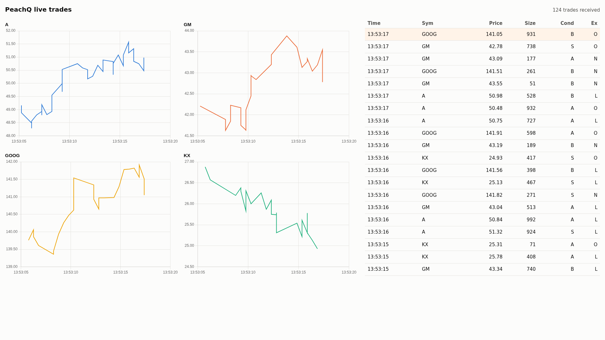
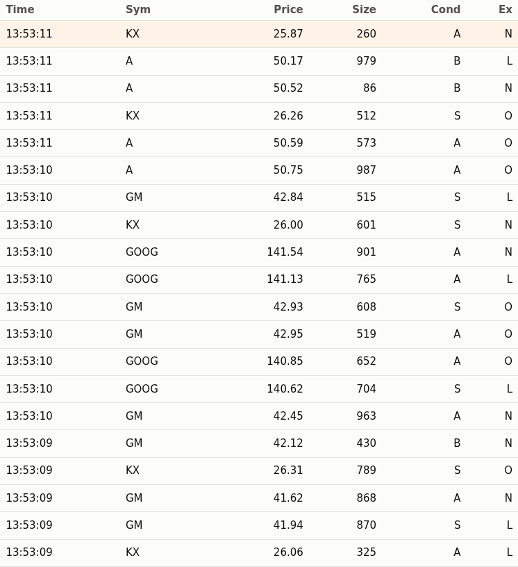

<!-- peachq: audience="You are a Node.js developer who knows JavaScript and async/await well and q only a little. You use Node 20 or newer without build tooling or a framework, and you want to show query results on a web page or display live ticking data." goal="Connect to PeachQ from Node, run a query and use the result as JavaScript objects, subscribe to live updates and render them in a browser, and send data with a small feed handler, with the q-to-JavaScript type mapping you need for your own tables." -->

# Node.js API

<video class="peachq-video" controls preload="none" playsinline src="/video/nodejs-api-FHD.mp4" poster="/recordings/nodejs-api/intro-frame.png"></video>

Connect Node.js to PeachQ with [jkdb](https://github.com/jshinonome/jkdb), a
zero-dependency q client with a Promise API. Three short scripts and one HTML
page cover the common jobs: a feed handler streams trades into a PeachQ table,
a query reads a live summary back as JavaScript objects, and a relay subscribes
to updates and pushes each batch to a browser page that draws a price chart per
symbol and a scrolling trade tape.



## Clients

Both clients speak q IPC from Node.js to a separate PeachQ process.

| Client | API | When to use it |
| --- | --- | --- |
| [jkdb](https://github.com/jshinonome/jkdb) 1.4.0 (Apache-2.0) | Promises, `upd` events for subscriptions, typed arrays for sending tables | Start here for a new project. Used by this article. |
| [node-q](https://github.com/michaelwittig/node-q) 2.7.0 (MIT) | Callbacks, typed values via wrappers such as `nodeq.short(1)` and `nodeq.shorts([1, 2])` | Existing node-q code, or when you need node-q's wider set of sendable types. A development dependency of KX's VS Code extension. |

Add jkdb to your own project with `npm install jkdb`. Both clients' test
suites were run against PeachQ; see
[Tested against PeachQ](#tested-against-peachq).

## Run it

Use Linux x86-64, Bash, `curl`, `tar`, `unzip` and Node.js 20 or newer with
`npm`. The same scripts run on Windows and macOS once PeachQ is downloaded for
that platform. Start in a fresh directory. The PeachQ server runs in one
terminal; the Node.js scripts run in another.

**Terminal 1: download PeachQ and the examples, then start the server:**

```bash
mkdir peachq-nodejs-api && cd peachq-nodejs-api
mkdir peachq
curl -fL https://peachq.org/download/peachq-linux-x64.tar.gz | tar -xz -C peachq
curl -fLO https://peachq.org/docs/interfaces/examples/nodejs-api-examples.zip
curl -fLO https://peachq.org/docs/interfaces/examples/nodejs-api-server.q
./peachq/q nodejs-api-server.q -p 5003
```

**Terminal 2: stream trades, query them, then relay updates to a browser:**

```bash
cd peachq-nodejs-api
unzip -q nodejs-api-examples.zip && cd nodejs-api-examples
npm install
node feed.mjs > feed.log &
node query.mjs
node relay.mjs
```

Open <http://localhost:3000> in a browser. The feed handler writes its
progress to `feed.log`; watch it with `tail -f feed.log`. To stop, run `kill %1`
to end the feed handler, press **Ctrl+C** to stop the relay, and press
**Ctrl+C** in terminal 1 to stop the server.

The [examples zip](examples/nodejs-api-examples.zip) contains `package.json`,
which pins jkdb 1.4.0 and [ws](https://github.com/websockets/ws) 8.22.0, the
three scripts, the HTML page and a short README. The
[server script](examples/nodejs-api-server.q) creates the `trade` table, a
minimal publisher and handlers that print each connection and query.

## Query

`query.mjs` connects, runs one query and prints the result with the `rows`
helper defined under [Tables arrive as columns](#tables-arrive-as-columns).
The shipped script reads the port from the `PEACHQ_PORT` environment variable,
defaulting to 5003:

```js
import { QConnection } from 'jkdb';

const q = new QConnection({ host: 'localhost', port: 5003 });
await q.connectAsync();

const summary = await q.syncAsync('0!select trades:count i,sum size by sym from trade');
console.table(rows(summary));
```

```text
┌─────────┬────────┬────────┬───────┐
│ (index) │ sym    │ trades │ size  │
├─────────┼────────┼────────┼───────┤
│ 0       │ 'A'    │ 87     │ 43988 │
│ 1       │ 'GM'   │ 70     │ 33584 │
│ 2       │ 'GOOG' │ 80     │ 36951 │
│ 3       │ 'KX'   │ 103    │ 52631 │
└─────────┴────────┴────────┴───────┘
```

The numbers differ on every run because the feed generates random trades.

`syncAsync` sends a message and resolves with the reply. If q signals an error,
the promise rejects with an `Error` whose message is the q error, for example
`type` for `1+`a`. Call `closeAsync()` when you have finished with a connection.

### Tables arrive as columns

jkdb returns a table as an object with one array per column, plus a
`Symbol.for('meta')` property holding the column names (`c`) and type letters
(`t`), in the order q defined them. `console.log` prints the summary as:

```js
{
  sym: [ 'A', 'GM', 'GOOG', 'KX' ],
  trades: [ 87, 70, 80, 103 ],
  size: [ 43988, 33584, 36951, 52631 ],
  [Symbol(meta)]: { c: [ 'sym', 'trades', 'size' ], t: [ 's', 'j', 'i' ] }
}
```

Columns are the natural shape for charts and aggregations. For `console.table`,
templates and JSON responses, turn them into one object per row:

```js
const rows = table => {
  const { c: columns } = table[Symbol.for('meta')];
  return table[columns[0]].map((_, i) => Object.fromEntries(columns.map(name => [name, table[name][i]])));
};
```

A query grouped with `by`, such as `select trades:count i by sym from trade`,
returns a keyed table. jkdb merges the key and value columns into one object and
lists the key names under `Symbol.for('keys')`. The `0!` prefix in the query
above unkeys the result on the server instead, which keeps the client code
simple.

### Call a function with arguments

Pass an array whose first element is q code and whose remaining elements are
the arguments. The code is evaluated on the server and applied to the
arguments, so a lambda works as a parameterised query:

```js
const recent = await q.syncAsync(['{[s;n] n#select time,price,size from trade where sym=`$s}', 'GOOG', -3n]);
console.table(rows(recent));
```

```text
┌─────────┬──────────────────────────┬────────┬──────┐
│ (index) │ time                     │ price  │ size │
├─────────┼──────────────────────────┼────────┼──────┤
│ 0       │ 2026-10-08T12:52:34.402Z │ 148.49 │ 429  │
│ 1       │ 2026-10-08T12:52:34.903Z │ 148.23 │ 344  │
│ 2       │ 2026-10-08T12:52:35.912Z │ 147.93 │ 267  │
└─────────┴──────────────────────────┴────────┴──────┘
```

Two details matter here. A JavaScript string is sent as a q char list, not a
symbol, so the lambda casts it with `` `$s `` before comparing it with the
symbol column. A JavaScript number is sent as a q float, which `#` rejects as a
count; the BigInt `-3n` is sent as a q long, so `-3#` returns the last three
rows.

### Values arrive as JavaScript types

| q type | JavaScript value | Null | Infinities |
| --- | --- | --- | --- |
| boolean | `true` or `false` | | |
| guid | 32-character hex string | `"00000000000000000000000000000000"` | |
| byte, short, int | number | `NaN` (byte has no null) | `Infinity`, `-Infinity` |
| long | number, or `BigInt` with `useBigInt: true` | `NaN` | `Infinity`, `-Infinity` |
| real, float | number | `NaN` | `Infinity`, `-Infinity` |
| char, char list | string | `" "` | |
| symbol | string | `""` | |
| timestamp | `Date` to the millisecond, or an ISO string with nine fractional digits with `includeNanosecond: true` | `null` (`""` with `includeNanosecond`) | `null` (`""` with `includeNanosecond`) |
| date, datetime | `Date` | `null` | `null` |
| month, timespan, minute, second, time | string in q notation, such as `"2001.02m"`, `"1D02:03:04.005006007"`, `"01:02"`, `"01:02:03"` and `"01:02:03.004"` | `null` | `null` |
| general list | array | | |
| dictionary | object; non-symbol keys are converted to strings | | |
| table | object of column arrays with `Symbol.for('meta')` | | |
| keyed table | as a table, plus `Symbol.for('keys')` | | |
| lambda | string holding the source | | |

Every array carries its q type letter in `Symbol.for('kType')`, so
`summary.trades[Symbol.for('kType')]` is `'j'`.

Two constructor options change the mapping. A q long holds 64 bits, but a
JavaScript number is exact only up to 2^53, so `9007199254740993` arrives as
`9007199254740992` by default. With `useBigInt: true`, longs arrive as
`BigInt` values and `syncAsync('9007199254740993')` resolves to
`9007199254740993n`. A `Date` holds milliseconds, so the default mapping
truncates `2001.02.03D04:05:06.123456789` to `.123`. With
`includeNanosecond: true`, timestamps arrive as the string
`"2001-02-03T04:05:06.123456789"`, which you can parse yourself.

## Subscribe and render

A subscriber registers with a publisher once, then receives every new batch of
rows as an asynchronous message. The server script contains a tiny publisher:
`.u.sub` records the caller's handle, and `.u.upd` inserts each batch into the
table and forwards it to every subscriber.

```q
trade:([]time:`timestamp$();sym:`symbol$();price:`float$();size:`int$();stop:`boolean$();cond:`char$();ex:`char$())
subs:`int$()
.u.sub:{[t;s] subs,:.z.w; 0#value t}
.u.upd:{[t;x] t insert x; {neg[x] (`upd;y;z)}[;t;x] each subs;}

.z.po:{-1 "open  handle ",string x;}
.z.pc:{subs::subs except x; -1 "close handle ",string x;}
.z.pg:{-1 "query ",$[10h=type x;x;-3!x]; value x}
```

`relay.mjs` subscribes with one synchronous call. jkdb emits an `upd` event for
every asynchronous message whose first element is the symbol `upd`, which is
the convention a kdb+ tickerplant follows too. Each event carries the q list
`` (`upd;`trade;table) ``, destructured below into the table name and the new
rows:

```js
const q = new QConnection({ host: 'localhost', port: 5003 });
q.on('upd', ([, table, data]) => {
  const message = JSON.stringify({ table, rows: rows(data) });
  for (const browser of browsers.clients) browser.send(message);
  console.log(`${table}: ${data.sym.length} rows to ${browsers.clients.size} browser(s)`);
});
await q.connectAsync();
await q.syncAsync('.u.sub[`trade;`]');
```

The same process serves `index.html` over HTTP and accepts WebSocket
connections with the `ws` package, so the page and its data share one port:

```js
const page = await readFile(new URL('./index.html', import.meta.url));
const web = createServer((request, response) => {
  response.writeHead(200, { 'content-type': 'text/html; charset=utf-8' });
  response.end(page);
});
const browsers = new WebSocketServer({ server: web });
web.listen(3000);
```

`JSON.stringify` turns each `Date` into an ISO string and leaves numbers,
strings and booleans as they are, so the browser receives plain JSON rows with
no q types to decode. The relay prints `Subscribed to trade; open
http://localhost:3000` once it is listening, then one line per batch while the
feed handler runs:

```text
trade: 5 rows to 1 browser(s)
trade: 5 rows to 1 browser(s)
trade: 7 rows to 1 browser(s)
```

The page keeps one [Chart.js](https://www.chartjs.org/) line chart per symbol,
holding the latest 200 points, and a table of the latest twenty trades. For
every row in a message it appends a point to that symbol's chart, creating the
chart the first time a symbol appears, and prepends a row to the tape:

```js
socket.onmessage = event => {
  const { rows } = JSON.parse(event.data);
  for (const trade of rows) { plot(trade); tick(trade); }
  received += rows.length;
  status.textContent = `${received} trades received`;
  for (const chart of charts.values()) chart.update('none');
};
```



Chart.js 4.5.0 (MIT) loads from a pinned jsDelivr URL in `index.html`; the page
needs internet access for that one script. Everything else is served by
`relay.mjs`.

## Send data with a feed handler

A feed handler converts data from an external source into q objects and sends
them to q. `feed.mjs` generates between one and ten random trades every half
second and sends each batch with `asyn`, which writes the message and returns
without waiting for a reply:

```js
setInterval(() => {
  const trades = batch();
  q.asyn(['.u.upd[`trade]', trades]);
  console.log(`Sent ${trades.sym.length} trades`);
}, 500);
```

```text
Sent 8 trades
Sent 7 trades
Sent 4 trades
```

The first element, `` .u.upd[`trade] ``, is q code that evaluates to a projection
of `.u.upd` with the table name fixed, and the batch becomes its remaining
argument. A JavaScript string would be sent as a char list, not a symbol, so
naming the table inside the q code is the simplest way to pass `` `trade ``.

`batch()` builds the table as one array per column. jkdb sends a plain array as
a general list and a plain number as a float, so each column names its q type
in `Symbol.for('kType')`, and the table names its columns and types in
`Symbol.for('meta')`:

```js
const typed = (values, type) => Object.assign(values, { [Symbol.for('kType')]: type });

const trades = {
  time: typed(sym.map(() => new Date()), 'p'),
  sym: typed(sym, 's'),
  price: typed(price, 'f'),
  size: typed(sym.map(() => 1 + Math.floor(Math.random() * 1000)), 'i'),
  stop: typed(sym.map(() => Math.random() < .1), 'b'),
  cond: sym.map(() => pick('ABS')).join(''),
  ex: sym.map(() => pick('LNO')).join(''),
};
trades[Symbol.for('meta')] = { c: Object.keys(trades), t: ['p', 's', 'f', 'i', 'b', 'c', 'c'] };
```

| JavaScript column | `kType` | q column |
| --- | --- | --- |
| `Date[]` | `'p'`, `'d'` or `'z'` | timestamp, date or datetime; `null` sends the null |
| `string[]` | `'s'` | symbol |
| `number[]` | `'f'` | float |
| `number[]` | `'i'` or `'j'` | int or long; `NaN` or `null` sends the null, `Infinity` the infinity; BigInt values are accepted for `'j'` |
| `boolean[]` | `'b'` | boolean |
| `string[]` | `'g'` | guid, from 32-character hex strings |
| `string` | `'c'` | char, one character per row |

These match the empty `trade` table in the server script. A char column is a
single string, not an array of characters. The `time` column is a timestamp
because jkdb 1.4.0 sends `Date` values only as timestamps, dates or datetimes;
it cannot send q time, minute, second, timespan or month values, nor byte,
short or real columns.

In terminal 1, `count trade` grows each time you run it. `asyn` suits a feed:
the handler does not wait for q to process each batch, but it also receives no
error. If a batch does not match the table's columns, the insert fails on the
server and the Node.js program carries on. Check the table in q while
developing a feed handler, or send the first batches with `syncAsync` so a
mistake rejects the promise.

## Watch the server

The server script replaces three q event handlers so that it prints what the
Node.js programs do. `.z.po` runs when a connection opens, `.z.pc` when it
closes, and `.z.pg` for each synchronous message, which it prints before
evaluating. Running the commands in [Run it](#run-it), then stopping the relay
and the feed handler, prints:

```text
open  handle 5
open  handle 6
query 0!select trades:count i,sum size by sym from trade
query ("{[s;n] n#select time,price,size from trade where sym=`$s}";"GOOG";-3)
close handle 6
open  handle 6
query .u.sub[`trade;`]
close handle 5
close handle 6
```

Handle 5 is the feed handler, which stays connected until it is stopped. The
query script and the relay each open their own connection; the relay is handle
6 until it is stopped. The function call
is printed as the list the client sent: the lambda and `"GOOG"` as char lists,
and `-3` as a long.

The feed handler's `.u.upd` messages are asynchronous, so `.z.pg` does not see
them. See
[Observe connection and message handlers](../guides/interprocess-communication.md#observe-connection-and-message-handlers)
for all four IPC handlers.

## Tested against PeachQ

Both clients ship test suites. They were run unchanged against the PeachQ
release used by this article, with each failure traced to its cause; the
recording ends with these runs.


| Suite | What it covers | Result |
| --- | --- | --- |
| jkdb `npm test` | 73 offline tests that serialise and deserialise IPC bytes for every supported type, including compressed messages | 73 passed |
| jkdb `npm run integration` | 7 tests against a q started as `q -p 1999`: synchronous queries, replies to messages the server sends, the deferred-response (`-30!`) API, `.z.pw` credential checks and a dropped connection | 6 passed, 1 failed |
| node-q `make itest` | 295 offline unit tests, then 158 tests against q on ports 5000 and 6000: synchronous and asynchronous requests, every type in both directions, keyed and flipped tables, nanosecond timestamps, unicode, compressed messages, subscriptions through kdb-tick's `u.q`, and TLS | 295 passed; 155 passed, 3 failed |

The four failures:

- jkdb `lost connection while querying` starts a second q and connects to it
  in the same tick. PeachQ takes 0.1 to 0.2 seconds to open its port, so the
  connection is refused. The same test passes when the client waits for the port
  to open.
- node-q `readme Subscribe to kdb+tick` and `subs subscribe all` run after
  `issue18.js` has created a table without a `sym` column. The subscription
  `` .u.sub[`;`] `` then fails inside `u.q` on that table before reaching
  `trade`. Both tests pass on PeachQ when run on their own.
- node-q `tls should connect successfully if useTLS is true` fails because
  release 0.88 of PeachQ accepts `-E 2` but does not complete a TLS handshake.

A separate round trip of every q type through jkdb, including nulls,
infinities, nested lists, dictionaries, keyed tables, GUIDs, every temporal
type and unicode strings, produced the same results from PeachQ on loopback and
on a network address, where replies over 2000 bytes arrived compressed and were
decompressed by jkdb. The differences found are all jkdb's own mapping choices,
listed in the caveats below.

## Summary

You have streamed trades into PeachQ from Node.js, queried them back as
JavaScript objects, and relayed live updates to a browser chart.

Caveats found while testing jkdb 1.4.0 against PeachQ:

- On the server, [`.z.u`](../ref/dotz.md#zu-user-id) is the user ID the client
  sent when it connected. PeachQ sets `.z.u` only when the login string contains
  a colon. jkdb always sends `user:password`, with `user` defaulting to the
  `USER` environment variable, so `.z.u` is set for jkdb connections. Pass
  `user` and `password` to `QConnection` to control it.
- jkdb cannot send q symbol or guid atoms, or byte, short, real, month,
  timespan, minute, second or time values. Cast inside q code, as the examples do, or choose
  timestamp, date, long, int and float columns for tables you send.
- Symbols containing non-ASCII characters are corrupted when sent by jkdb,
  because it counts UTF-16 units rather than bytes. Receiving them works.
- Temporal infinities such as `0Wp` arrive as `null`, the same as nulls.
  Timestamps before 2000 with a fractional millisecond are rounded towards
  2000 by one millisecond.
- A sorted dictionary (`` `s# `` on a dictionary, type 127) and derived
  functions such as `+/` (types 106 to 111) cannot be received; jkdb rejects
  the message with `UNSUPPORTED_K_TYPE`.
- Longs beyond 2^53 need `useBigInt: true`; timestamps beyond the millisecond
  need `includeNanosecond: true`, after which they arrive as strings.

Report problems at [PeachQ issues](https://github.com/peachq-org/peachq/issues).
