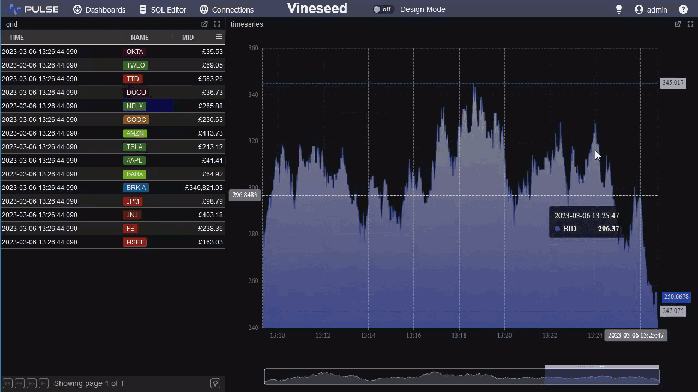
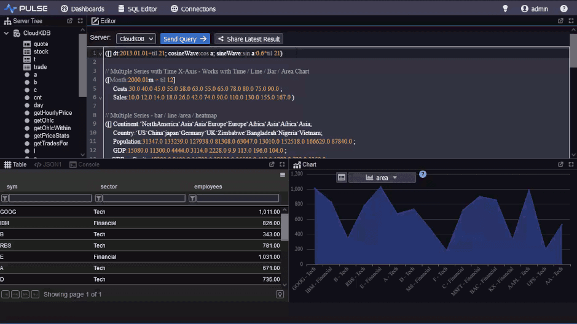

<!-- peachq: audience="You have PeachQ running and want browser dashboards or a shared web editor on top of it. You know enough q to write a select." goal="Connect Pulse to a PeachQ process, run a query in its web editor and build a dashboard with a table and a time-series chart." -->

# Pulse on PeachQ

<video class="peachq-video" controls preload="none" playsinline src="/video/pulse-FHD.mp4" poster="/recordings/pulse/intro-frame.png"></video>

[Pulse](https://www.timestored.com/pulse/) is a web application for building
dashboards and internal tools on top of databases, including q processes. It
includes a browser SQL editor with a server tree, result tables and charts, and
dashboard components that update from queries or from kdb+ style subscriptions.
Pulse is free for up to three users.



## Setup

Pulse needs Java 8 or later. Check with `java -version`.

Start PeachQ listening on a port and create a table, as in
[qStudio on PeachQ](../editors/qstudio.md#setup):

```bash
./q -p 5000
```

<!-- peachq: title="Create a trade table" -->
```q
trade:([]time:.z.p+0D00:00:01*til 100;sym:100?`AAPL`MSFT`GOOG;price:100+100?10f;size:100?1000)
```

In a second terminal, download Pulse and start it on port 8080:

```bash
curl -fLO https://www.timestored.com/pulse/files/pulse.jar
SERVER_PORT=8080 java -jar pulse.jar
```

Open `http://localhost:8080` in a browser. Windows and Linux packages are on
the [Pulse download page](https://www.timestored.com/pulse/download), and the
[install help](https://www.timestored.com/pulse/help/install) covers ports,
login settings, licence keys and running it as a service.

## Connect to PeachQ

1. Open **Connections** and choose **Add Data Connection**.
2. Set the type to **kdb**, the host to `localhost` and the port to `5000`.
   Leave the username and password empty.
3. Save. The connection is now available to the SQL editor and to every
   dashboard.

## Query from the browser

Open **SQL Editor**, pick the PeachQ connection and run:

```q
select avg price,sum size by sym from trade
```

The result appears as a table below the editor, with a chart tab beside it.
The server tree on the left lists tables and functions from the process.



## Build a dashboard

1. Open **Dashboards** and create a new dashboard.
2. Add a **Table** component and set its query to
   ``select from trade where sym=`AAPL``, using the PeachQ connection.
3. Add a **Time Series** chart and set its query to
   ``select time,price from trade where sym=`AAPL``. Pulse plots numeric
   columns against the first time column.
4. Set a refresh interval on each component to poll PeachQ, or leave it static.
