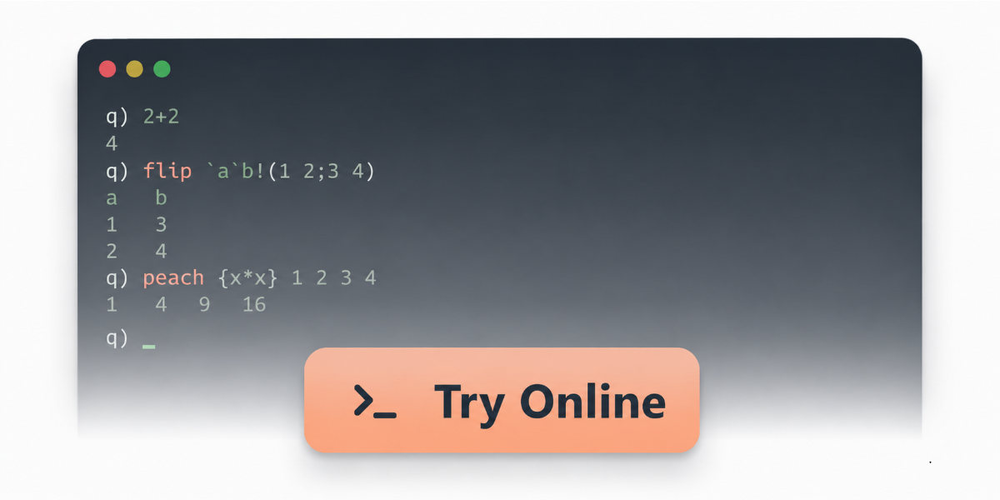

# Announcing PeachQ

Today I'm excited to announce PeachQ: an open-source implementation of the q
programming language.

<!-- more -->

The goal is simple: I want to be able to run q anywhere, recommend it freely, and
extend it in whatever direction the future takes us. More importantly, I want
everyone else to be able to do the same.

If that sounds interesting, I'd love you to take a look:
[peachq.org](https://peachq.org).

## Why now?

Technology is changing faster than ever. AI is transforming how software is
built, tested and maintained. I believe this is an opportunity to build an open q
ecosystem that can evolve with it.

I've spent much of the last 15 years building tools around q, from QStudio to
Pulse, because I've always believed q is one of the most elegant languages for
working with data. That hasn't changed.

Q was and still is a beautiful language and platform. PeachQ is an attempt to
preserve what's great about q while building an open implementation that can
evolve in public, with compatibility, transparency and community involvement at
its core.

It's still early, but it's already usable.
