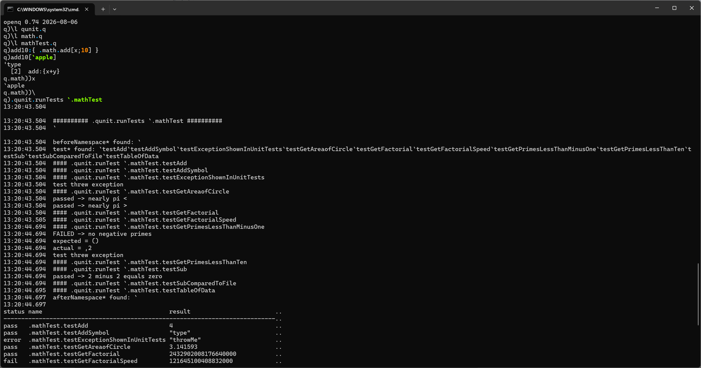

# peachq v0.74 released

PeachQ 0.74 is out. This release adds live views, makes namespaces real q
values, deepens functional qSQL support and improves compatibility across
functions, arithmetic, IPC and the parser.

The milestone that matters most, though, is what those pieces make possible:
**PeachQ can now load and run [qunit](https://github.com/timestored/kdb/tree/master/qunit),
the q unit-testing framework.**

<!-- more -->

## From language features to real q programs

A compatibility percentage is useful, but running an existing framework is a
much harder test. qunit uses namespaces, function introspection, projections,
errors, qSQL and file loading together. With 0.74, the upstream framework and
its example maths suite load, the tests are discovered by name, and
`.qunit.runTests` executes all 11 of them.

```q
q)\l qunit.q
q)\l math.q
q)\l mathTest.q
q).qunit.runTests `.mathTest
```

The result is a table with a row for every test, including its status, result,
time and memory use. The upstream example suite deliberately contains a
failing assertion and an uncaught-error example, so the interesting result is
not an artificially green table: it is that the real framework loads,
discovers and runs the suite, and reports those outcomes correctly.



*qunit running its example suite in PeachQ 0.74 on Windows.*

## Views that stay up to date

Views are defined with `::`. Their values are cached, their dependencies are
tracked, and changing a source invalidates every dependent view transitively.

```q
q)base:10 20 30
q)subtotal::sum base
q)tax::0.2*subtotal
q)total::subtotal+tax
q)total
72f

q)base:100 200
q)subtotal
300
q)total
360f
```

Nothing needed to be refreshed by hand: changing `base` invalidated
`subtotal`, `tax` and `total`, and each was recalculated when next requested.
The definitions are introspectable too:

```q
q)views `
`s#`subtotal`tax`total
q)view `total
"subtotal+tax"
```

The same semantics apply when source text is passed to `value` or sent over
IPC. The rest of the view surface is present as well, including `view`,
`views`, `\b`, `\B`, `.z.b` and `.z.vs`.

## Namespaces are values

Namespaces are now q-owned, dictionary-backed environments rather than an
implementation detail. `\d` changes context as expected, while `\v`, `\f`,
`\a`, `key` and `tables` inspect it. Namespaces can also be passed around and
expunged like other q values.

```q
q)\d .prices
q.prices)vat:0.2
q.prices)gross:{x*1+vat}
q.prices)\v
,`vat
q.prices)\f
,`gross
q.prices)gross 100
120f
q.prices)\d .
```

This is a large part of why code such as qunit now works: established q
libraries expect namespaces to be both execution contexts and inspectable
data.

## More honest functions, numbers and qSQL

`value` now exposes the derivable parts of lambdas, projections, compositions
and derived functions. Operator identity comes from the same manifest used by
IPC, keeping `value` and the 101h/102h/103h wire types aligned with kdb+.

The 32-bit real (`e`) lane now runs end to end through arithmetic, aggregates,
scans and sorting. Positive and negative infinities—including real and
temporal infinities—remain ordinary values; only NaN is null. The accompanying
pass also removes integer overflow hazards and brings min/max behavior closer
to kdb+ at null and window edges.

Functional qSQL adds `fby`, ordered `exec`-by results, one-row aggregates,
`update`-by and more `delete` and `exec` edge cases. Aggregate and map-family
lifts now reach rank-2 nested lists. Signal (`'`) and explicit return (`:`)
also follow q control flow more closely.

## Compatibility work across the stack

There is a long tail of fixes in 0.74: dictionary behavior in `where` and
`raze`; `wsum` and `wavg`; structural comparison of functions; indexing into
a function; context-relative `key`; typed-vector rendering; and parser edge
cases around keywords and unary glyphs.

IPC now honors a lambda's namespace on decode, preserves i32-backed temporal
nulls and gate-checks parse-tree round trips over the kdb+ wire format. The
browser build is back on the same evaluation pipeline as native PeachQ and is
checked as part of the release. Name lookup is faster, `make q-bench` provides
a committed performance smoke test, and Windows builds now use matching
optimization settings.

Downloads are on the [releases page](https://github.com/peachq-org/peachq/releases).
If you have a q library you would like PeachQ to run next, try it and
[tell us where it breaks](https://github.com/peachq-org/peachq/issues).
